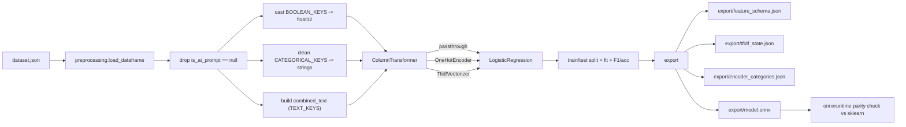

# Phishcatch ML Training Pipeline (dataset.json -> model.onnx)

## SCOPE

- Target repo: ONLY `/Users/ryanknittel/Documents/GitHub/phishcatch`. New code lives in a new top-level `pipeline/` directory (sibling of `extension/` and `server/`).
- `l8p8-chrome-extension` is untouched/read-only.
- This plan covers the Python pipeline only. It produces artifacts the TypeScript extension will later consume; no extension code changes here.

## Confirmed against the data

- `/Users/ryanknittel/Downloads/dataset.json` is a flat array whose keys match the extension's `RawFieldData` ([extension/src/types.ts](extension/src/types.ts)). Structural keys are real JSON booleans; text keys are strings (including empty `aria_expanded`/`aria_haspopup`); `is_ai_prompt` is `true`/`false`/`null`.

## Key decisions

- Three feature groups instead of "structural + text". Programmatic, finite-vocabulary attributes (`tag_name`, `type`, `role`, `aria_expanded`, `aria_haspopup`, `autocomplete`) are CATEGORICAL, not natural language: feeding them to TF-IDF dilutes strong deterministic signals (e.g. `tag_name="input"` appears everywhere and gets penalized). They are one-hot encoded. ARIA tokens like `aria-haspopup` are not strict booleans (`menu`/`listbox`/`dialog`/...), so one-hot (not a boolean cast) is correct. Only genuinely human-readable strings stay in TF-IDF text.
- Classifier: `LogisticRegression(max_iter=1000)` default - sparse-friendly, tiny/robust ONNX, well supported by skl2onnx. (Depth-limited `RandomForestClassifier` is the documented alternative; LR keeps ONNX well under 5MB.)
- TF-IDF and OneHotEncoder both run INSIDE the ONNX graph (text + categorical inputs are `StringTensorType`), so the browser passes raw strings and ONNX does tokenization/encoding - the true anti-skew path. `tfidf_state.json` and `encoder_categories.json` are still exported (per requirement) for verification / a pure-JS fallback. The only logic the extension must replicate is the `combined_text` build rule (TEXT_KEYS order, strip, drop-empty, space-join) and the categorical fill rule.
- Three ONNX inputs exactly (per requirement): `booleans` (FloatTensorType `[None, B]`), `categorical` (StringTensorType `[None, C]`), `combined_text` (StringTensorType `[None, 1]`). To route three groups through one `ColumnTransformer`, the transformer selects by integer column index (not names) so skl2onnx maps each group to one typed input - see Steps 3 and 5.

## Data flow



## File structure (new)

- `pipeline/schema.py` - single source of truth constants + schema writer.
- `pipeline/preprocessing.py` - load, label-drop, combined_text, boolean casting.
- `pipeline/model.py` - builds the sklearn pipeline.
- `pipeline/export_onnx.py` - writes the four artifacts + runs the parity check.
- `pipeline/train.py` - CLI entry point orchestrating everything.
- `pipeline/requirements.txt`, `pipeline/README.md`
- `pipeline/export/` - output dir (gitignored).
- Update root `.gitignore` for `pipeline/export/`, `__pycache__/`, `.venv/`.

## Step 1 - Schema constants ([pipeline/schema.py](pipeline/schema.py))

Define the exact arrays (order preserved) and the schema writer:

```python
TARGET_KEY = "is_ai_prompt"
BOOLEAN_KEYS = ["read_only", "disabled", "required", "is_content_editable"]
CATEGORICAL_KEYS = ["tag_name", "type", "role", "aria_expanded", "aria_haspopup", "autocomplete"]
TEXT_KEYS = ["id", "name", "class_name", "placeholder", "data_placeholder", "data_test_id",
             "data_testid", "aria_label", "aria_placeholder", "aria_roledescription", "title",
             "aria_labelledby", "aria_describedby", "aria_controls", "aria_errormessage",
             "aria_labelledby_text", "aria_describedby_text", "aria_controls_text",
             "aria_errormessage_text", "official_label_text", "fuzzy_parent_text", "button_text",
             "form_control_name", "dataset_attributes"]
COMBINED_TEXT_COLUMN = "combined_text"
```

Note the moves vs the prior plan: `tag_name`, `type`, `role`, `aria_expanded`, `aria_haspopup`, `autocomplete` are now CATEGORICAL (one-hot), removed from TEXT_KEYS.

`write_feature_schema(path)` dumps `{ "target_key", "boolean_keys", "categorical_keys", "text_keys", "combined_text_column" }` so the TS side loops keys in identical order.

## Step 2 - Preprocessing ([pipeline/preprocessing.py](pipeline/preprocessing.py))

- `load_dataframe(path)`: `pd.read_json(path)`; reindex to guarantee all BOOLEAN_KEYS + CATEGORICAL_KEYS + TEXT_KEYS columns exist (fill missing).
- Drop unlabeled rows: `df = df[df[TARGET_KEY].notna()].copy()` (removes raw captures where `is_ai_prompt` is null).
- Boolean casting: `df[k] = df[k].fillna(False).astype(bool).astype("float32")` for each BOOLEAN_KEYS (1.0/0.0).
- Categorical cleaning: for each CATEGORICAL_KEYS, `df[k] = df[k].fillna("").astype(str)` (empty string for missing - OneHotEncoder will learn `""` as its own category, and `handle_unknown="ignore"` covers novel values at inference).
- `combined_text` (TEXT_KEYS only): for each row iterate TEXT_KEYS, skip None/NaN, `str(v).strip()`, drop empties, `" ".join(parts)`.
- Target: `y = df[TARGET_KEY].astype(bool).astype("int64")`.
- Returns `X = df[BOOLEAN_KEYS + CATEGORICAL_KEYS + [COMBINED_TEXT_COLUMN]]` (booleans, then categoricals, then text - this column order is what the integer-index ColumnTransformer and the ONNX input order depend on), and `y`.

## Step 3 - Model pipeline ([pipeline/model.py](pipeline/model.py))

With X columns ordered `[*BOOLEAN_KEYS, *CATEGORICAL_KEYS, combined_text]`, let `B = len(BOOLEAN_KEYS)` and `C = len(CATEGORICAL_KEYS)`:

```python
ColumnTransformer([
    ("bool", "passthrough", list(range(0, B))),                                  # float block
    ("cat",  OneHotEncoder(handle_unknown="ignore", sparse_output=False),
             list(range(B, B + C))),                                             # string block
    ("text", TfidfVectorizer(min_df=2, max_df=0.9), B + C),                      # scalar index -> 1D strings
])
```

wrapped in `Pipeline([("features", ct), ("clf", LogisticRegression(max_iter=1000))])`. Integer-index selection (booleans 0..B-1, categoricals B..B+C-1, text at B+C) is what lets skl2onnx map exactly three typed inputs in that order. `sparse_output=False` is required so the dense one-hot floats concatenate cleanly with the other blocks for both sklearn and skl2onnx.

> Deliberate choice - do NOT switch to string-name selection. Name-based `ColumnTransformer` selection forces skl2onnx to emit one ONNX input per column (~11 single-column inputs) instead of the 3 grouped tensors. Grouped tensors keep the `onnxruntime-web` client clean/fast (one `ort.Tensor` per group per element). The indices here are computed from the schema constant lengths and `X` is built in the same constant-driven order (`[*BOOLEAN_KEYS, *CATEGORICAL_KEYS, combined_text]`), so adding/removing a key shifts both consistently - it is not the brittle hardcoded-index antipattern.

## Step 4 - Train + evaluate ([pipeline/train.py](pipeline/train.py))

- `argparse`: `--data` (default `dataset.json`), `--export` (default `pipeline/export`).
- `train_test_split(test_size=0.2, random_state=42, stratify=y)` with a guard to skip stratify when a class is too small.
- Fit pipeline; print accuracy and F1 (`sklearn.metrics`), plus `classification_report`.
- Call `export_onnx.export_artifacts(...)`.

## Step 5 - Export artifacts ([pipeline/export_onnx.py](pipeline/export_onnx.py))

- `feature_schema.json`: via `schema.write_feature_schema` (`boolean_keys`, `categorical_keys`, `text_keys`, `target_key`, `combined_text_column`).
- `tfidf_state.json`: pull the fitted vectorizer `vec = pipeline.named_steps["features"].named_transformers_["text"]`; write `{ "vocabulary": {tok: int(i)}, "idf": vec.idf_.tolist() }`.
- `encoder_categories.json`: pull `ohe = pipeline.named_steps["features"].named_transformers_["cat"]`. `ohe.categories_` is a list of arrays aligned to CATEGORICAL_KEYS order. Write:

```json
{
    "categorical_keys": [
        "tag_name",
        "type",
        "role",
        "aria_expanded",
        "aria_haspopup",
        "autocomplete"
    ],
    "categories": {
        "tag_name": ["", "div", "input", "textarea"],
        "type": ["", "file", "textarea"],
        "...": ["..."]
    }
}
```

built as `{"categorical_keys": CATEGORICAL_KEYS, "categories": {k: [str(c) for c in cats] for k, cats in zip(CATEGORICAL_KEYS, ohe.categories_)}}`. TS reconstruction contract (for a pure-JS fallback): the one-hot vector is the per-key arrays concatenated in `categorical_keys` order; within a key, the hot index is that value's position in its category array; a value not in the array is all-zeros (matches `handle_unknown="ignore"`). With the encoder embedded in ONNX, the browser instead just passes the raw category strings and this file is for verification/fallback only.

- `model.onnx`: convert with three explicit initial types, ordered to match the X column blocks:

```python
initial_types = [
    ("booleans",      FloatTensorType([None, len(BOOLEAN_KEYS)])),
    ("categorical",   StringTensorType([None, len(CATEGORICAL_KEYS)])),
    ("combined_text", StringTensorType([None, 1])),
]
onnx_model = convert_sklearn(pipeline, initial_types=initial_types,
                             options={id(pipeline): {"zipmap": False}})
```

`zipmap=False` keeps a clean float probability tensor for the browser. Save with `onnx.save_model`.

- Parity check: load `model.onnx` in `onnxruntime`, feed `{ "booleans": X_bool.astype(np.float32), "categorical": X_cat.astype(object), "combined_text": X_text.reshape(-1, 1) }`, and assert the ONNX predictions match `pipeline.predict` on the test set (fail loudly on drift).

## Step 6 - Python environment (install if missing)

- Python may not be installed on this machine (macOS/darwin). At implementation time, first check with `python3 --version`. If it is missing or older than 3.10, install it (with the user's go-ahead, since this modifies the system):
    - Preferred: Homebrew - `brew install python@3.12` (and `brew --version` first; if Homebrew itself is missing, install it via the official script or fall back to the python.org installer / `xcode-select --install` for build tools).
- Create an isolated environment in the pipeline dir: `python3 -m venv .venv && source .venv/bin/activate` so the pinned deps do not touch system Python.
- This is the one step that requires installing software on the user's computer; it will be done explicitly and announced, not silently.

## Step 7 - Packaging ([pipeline/requirements.txt](pipeline/requirements.txt), README, .gitignore)

- Pinned, mutually compatible versions (skl2onnx is strict about the sklearn version), e.g.: `pandas`, `numpy`, `scikit-learn==1.5.2`, `skl2onnx==1.17.0`, `onnx==1.16.2`, `onnxruntime==1.18.1`. README documents the Python check/install (Step 6), `python3 -m venv .venv`, install, and `python -m pipeline.train --data /path/to/dataset.json`.
- Root `.gitignore`: add `pipeline/export/`, `__pycache__/`, `.venv/`.

## Caveats

- `min_df=2` plus the 5-row sample will yield a near-empty vocabulary and an unstable split; this pipeline needs a realistically sized labeled set. The README will note lowering `min_df` only for smoke tests (the requirement value stays 2).
- skl2onnx version/sklearn mismatch is the most common failure; the pinned set above must be installed together, and the Step 5 parity check is the guardrail.
- `OneHotEncoder(handle_unknown="ignore")` emits an all-zero block for category values not seen in training (e.g. a novel `role` on a production site); this is intended and keeps inference robust. Categorical values are used as-is (no lowercasing) so training and serving must pass identical raw strings.
- The browser must reproduce two rules exactly: the `combined_text` build (TEXT_KEYS order, strip, drop-empty, single-space join) and the categorical fill (missing -> `""`), so the embedded TF-IDF and OneHotEncoder see identical inputs.

## Verification

- `python3 --version` reports >= 3.10 (installing Python first if it was missing), and a `.venv` is active.
- `pip install -r pipeline/requirements.txt` succeeds.
- `python -m pipeline.train --data /Users/ryanknittel/Downloads/dataset.json` runs end to end, prints metrics, writes the four files to `pipeline/export/`, and the onnxruntime parity assertion passes.
- `export/feature_schema.json` lists BOOLEAN_KEYS, CATEGORICAL_KEYS, and TEXT_KEYS in the exact order above; `export/encoder_categories.json` has one category array per categorical key; `model.onnx` exposes three inputs `booleans` (float[B]), `categorical` (string[C]), `combined_text` (string[1]).
