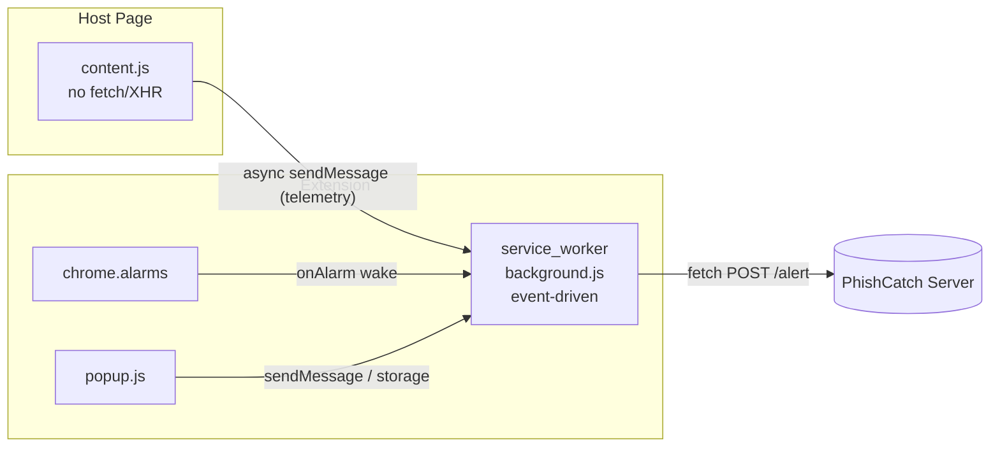

# Manifest V3 Migration Plan

## Scope note (read first)

The repository is stock PhishCatch: password-reuse detection plus TLSH DOM fingerprinting. There is no ONNX / WebAssembly / "AI prompt" code present (`onnx`/`wasm` only appear in lockfiles). This plan performs the MV3 architecture migration on the existing code and adds the `'wasm-unsafe-eval'` CSP directive as a forward-looking hook for `onnxruntime-web`. It does not add ML inference itself; say the word if you also want the ONNX classifier scaffolded.

## Current state (verified)

- [extension/public/manifest.json](extension/public/manifest.json): `manifest_version: 2`, persistent `background.scripts` (`background.js` + `vendor.js`), `browser_action`, string `content_security_policy`, permissions mix host + API perms.
- [extension/src/background.ts](extension/src/background.ts): registers `chrome.runtime.onMessage` / `chrome.notifications.onButtonClicked` listeners synchronously via `setup()` (good for SW), but also calls `timedCleanup()` which uses `setInterval` (breaks under SW).
- [extension/src/content.ts](extension/src/content.ts): only talks to background via `chrome.runtime.sendMessage` - no `fetch`/XHR. Network isolation is effectively already satisfied.
- [extension/src/lib/sendAlert.ts](extension/src/lib/sendAlert.ts): the only outbound `fetch`, invoked from the background context. Holds an in-memory `recentAlerts` Map + a module-level 24h `setTimeout`.
- Callback-style `chrome.storage` / `chrome.tabs` calls across `config.ts`, `userInfo.ts`, `clientId.ts`, `domhash.ts`, `timedCleanup.ts`, `sendAlert.ts`, and popup state files.
- [extension/src/lib/showCheckmarkIfEnterpriseDomain.ts](extension/src/lib/showCheckmarkIfEnterpriseDomain.ts): uses MV2-only `chrome.browserAction`.
- [extension/webpack/webpack.common.js](extension/webpack/webpack.common.js): `optimization.splitChunks` emits a shared `vendor.js` - incompatible with the MV3 single-file service worker.

## Target architecture

## Step-by-step changes

### 1. Overhaul the manifest - [extension/public/manifest.json](extension/public/manifest.json)

- `manifest_version: 3`.
- Replace `browser_action` block with `action` (same `default_icon` / `default_popup` / `default_title`).
- Replace persistent `background.scripts` with:
  `"background": { "service_worker": "js/background.js", "type": "module" }`.
- Split permissions:
    - `permissions`: `["storage", "notifications", "alarms"]` (add `alarms` for the cleanup timers).
    - `host_permissions`: `["<all_urls>"]` (replaces `http://*/*`, `https://*/*`).
- CSP -> MV3 object form, hardened with wasm support:
  `"content_security_policy": { "extension_pages": "script-src 'self' 'wasm-unsafe-eval'; object-src 'self'" }`.
- Keep `content_scripts` (the `js` array may still list `content.js` + `vendor.js`); keep `storage.managed_schema`, `icons`, `web_accessible_resources` (still `[]` unless ONNX assets are added later).

### 2. Service worker compatibility - [extension/src/background.ts](extension/src/background.ts)

- Keep listener registration at top level (already synchronous via `setup()`), so the worker wakes on `chrome.runtime.onMessage`.
- Remove the `setInterval`-based scheduling; replace `timedCleanup()` invocation with alarm registration (see step 3).
- Ensure `showCheckmarkIfEnterpriseDomain()` tab listeners are registered at top level (they already are inside `setup()`).

### 3. Replace timers with alarms - [extension/src/lib/timedCleanup.ts](extension/src/lib/timedCleanup.ts)

- Delete the two `setInterval` calls in `timedCleanup()`.
- Register a `chrome.alarms.create('phishcatch-cleanup', { periodInMinutes: 60 })` and add a top-level `chrome.alarms.onAlarm` listener in `background.ts` that runs `cleanupUsernamesAndPasswords()` and `tryToSendFailedAlerts()`.
- Convert callback `chrome.storage.local.set` calls here to `await`.

### 4. Migrate browser_action -> action - [extension/src/lib/showCheckmarkIfEnterpriseDomain.ts](extension/src/lib/showCheckmarkIfEnterpriseDomain.ts)

- `chrome.browserAction.setBadgeText` -> `chrome.action.setBadgeText`.
- `chrome.browserAction.setBadgeBackgroundColor` -> `chrome.action.setBadgeBackgroundColor`.

### 5. Promise-based chrome.\* APIs (modernize async handling)

Convert callback style to `async/await` (MV3 chrome.\* return Promises):

- [extension/src/config.ts](extension/src/config.ts): `getConfigOverride`, `getManagedPreferences`, `setConfigOverride`, `clearConfigOverride`.
- [extension/src/lib/userInfo.ts](extension/src/lib/userInfo.ts), [extension/src/lib/clientId.ts](extension/src/lib/clientId.ts), [extension/src/lib/domhash.ts](extension/src/lib/domhash.ts): `chrome.storage.local.get/set`.
- [extension/src/lib/sendAlert.ts](extension/src/lib/sendAlert.ts): convert `getUnsentAlerts` / `saveUnsentAlert` to `await`. The `recentAlerts` dedup cache is handled separately in step 5a (it cannot remain a module-level variable).
- [extension/src/content.ts](extension/src/content.ts): `await chrome.runtime.sendMessage(...)` for the three telemetry sends.
- Popup: [extension/src/react-popup/mobx/reportPhishingState.ts](extension/src/react-popup/mobx/reportPhishingState.ts) (`chrome.tabs.query`), [extension/src/react-popup/mobx/popupState.ts](extension/src/react-popup/mobx/popupState.ts), [extension/src/react-popup/home.tsx](extension/src/react-popup/home.tsx) (`chrome.storage.local.clear`).

### 5a. Persist the dedup cache across SW restarts - [extension/src/lib/sendAlert.ts](extension/src/lib/sendAlert.ts)

MV3 service workers are aggressively terminated (~30s idle), so the module-level `recentAlerts: Map<string, Date>` and its 24h `setTimeout` reset cannot retain state - dedup would silently break after every restart. Migrate the cache into extension storage:

- Use `chrome.storage.session` (preferred: in-memory, MV3-native, auto-cleared when the browser closes, never written to disk - ideal for short-lived 30s dedup keys). Fall back to `chrome.storage.local` only if `chrome.storage.session` is unavailable in the target Chrome version or the test mock.
- Delete the module-level `recentAlerts` `Map` and the `setTimeout(... 24h)` reset block.
- Rework `checkIfDup` into an `async` function that:
    1. Reads the dedup record map from storage (e.g. key `recentAlerts`, shape `Record<string, number>` mapping the existing `dupCheckString` to an epoch-ms timestamp).
    2. Prunes entries older than the 30s window (replaces the old timer-based reset and keeps the store bounded across restarts).
    3. Returns `true` if a fresh (within-window) entry exists; otherwise writes the new/updated timestamp back to storage and returns `false`.
- Update the caller in `createServerAlert` to `await checkIfDup(message)` before building/sending the alert.
- Because the read-modify-write is now async, note the minor race window between concurrent alerts; acceptable here since dedup is best-effort and the 30s window is generous.

### 6. Network/telemetry isolation (verify + enforce)

- Confirmed: `content.ts` performs no direct network I/O; all telemetry already flows content -> SW via messaging, and the single `fetch` lives in `sendAlert.ts` running in the worker. No code move required - document this as satisfied and keep the boundary (no new `fetch`/XHR in content scripts).

### 7. Webpack build for single-file service worker - [extension/webpack/webpack.common.js](extension/webpack/webpack.common.js)

- The MV3 `service_worker` must be one file, but `splitChunks` currently extracts a shared `vendor.js`. Exclude the `background` entry from chunk splitting, e.g.:
  `optimization.splitChunks.chunks = (chunk) => chunk.name !== 'background'`.
- Result: `background.js` is self-contained; `popup`/`content` keep the shared `vendor.js` (content_scripts can load multiple files).
- Verify the `CopyPlugin` still emits the updated `manifest.json` into `dist`.

### 8. Dependency / types updates - [extension/package.json](extension/package.json)

- Bump `@types/chrome` from `0.0.122` to a current release so `chrome.action`, `chrome.alarms`, and Promise-returning signatures type-check.
- Re-run the package manager (CI uses yarn) to refresh `yarn.lock`.

### 9. Tests - `extension/src/__tests__/*`

- `jest-webextension-mock` mocks MV2 APIs; verify it provides `chrome.action`/`chrome.alarms`/`chrome.storage.session`. Add lightweight mocks/shims if missing so the existing suites (`alerts.ts`, `alertDup.ts`, `expiry.ts`, `passwordHashing.ts`, etc.) still pass after the Promise/API changes.
- Update `alertDup.ts` for the now-async, storage-backed `checkIfDup` (it must `await` and seed/clear `chrome.storage.session` between cases).

## Files summary

- Modified: `manifest.json`, `background.ts`, `timedCleanup.ts`, `showCheckmarkIfEnterpriseDomain.ts`, `config.ts`, `userInfo.ts`, `clientId.ts`, `domhash.ts`, `sendAlert.ts`, `content.ts`, popup state/`home.tsx`, `webpack.common.js`, `package.json`.
- Created: none required (optional `js/background.js` stays a webpack output; ONNX assets + `web_accessible_resources` only if the classifier is added later).
- Deleted: none (the persistent background page becomes the service worker via manifest/webpack config, not a file removal).

## Verification

- `yarn build` produces `dist/` with a single `js/background.js` and an MV3 `manifest.json`.
- Load unpacked in Chrome: service worker registers, wakes on content-script telemetry, badge updates via `chrome.action`, alarms drive cleanup, alert POST succeeds from the worker, and the CSP loads with `wasm-unsafe-eval` (ready for `onnxruntime-web`).
- Dedup persistence: trigger two identical alerts within 30s, manually terminate the service worker between them (chrome://extensions -> "service worker" -> stop), and confirm the second is still suppressed because `recentAlerts` is read from `chrome.storage.session`.
- `yarn test` (Jest) passes.
