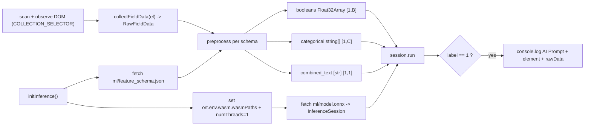

# Real-time ONNX Inference in the Content Script

## SCOPE

- Target repo: ONLY `/Users/ryanknittel/Documents/GitHub/phishcatch` (the `extension/` package). `l8p8-chrome-extension` stays read-only.
- Output is `console.log` only when an element is classified as an AI prompt. No network/telemetry/backend logging.

## What already exists (verified)

- `collectFieldData(el)` in [extension/src/content-lib/dataCollection.ts](extension/src/content-lib/dataCollection.ts) returns the flat `RawFieldData` we reuse (booleans as JS booleans, categoricals/text as strings). `COLLECTION_SELECTOR` is module-private there and must be exported.
- Manifest is MV3 with CSP `script-src 'self' 'wasm-unsafe-eval'` already set; `web_accessible_resources` is `[]`; `host_permissions: ["<all_urls>"]` ([extension/public/manifest.json](extension/public/manifest.json)).
- Webpack already uses `CopyPlugin` (copy-webpack-plugin 6.1.0) and a `splitChunks` vendor chunk shared by popup+content ([extension/webpack/webpack.common.js](extension/webpack/webpack.common.js)).
- Exported artifacts ([pipeline/export/feature_schema.json](pipeline/export/feature_schema.json)) use lowercase keys: `boolean_keys`, `categorical_keys`, `text_keys`, `combined_text_column`. ONNX inputs are `booleans`, `categorical`, `combined_text`; outputs are `label` (int64) + `probabilities`.

## Data flow



## Step 1 - Dependency

Add the runtime: `cd extension && corepack yarn add onnxruntime-web` (pin the resolved version in package.json/yarn.lock). It bundles into `vendor.js` (shared by popup+content via the existing splitChunks) and loads its `.wasm` at runtime.

## Step 2 - Bundle artifacts + wasm ([extension/webpack/webpack.common.js](extension/webpack/webpack.common.js))

Add two `CopyPlugin` patterns (output base is `dist/js`, so `to: '../ml'` => `dist/ml`):

```js
// ML artifacts produced by the Python pipeline
{ from: path.join(__dirname, '../../pipeline/export'), to: '../ml' },
// onnxruntime-web wasm binaries (and .mjs loaders if present for the installed version)
{ from: path.join(__dirname, '../node_modules/onnxruntime-web/dist/*.wasm'), to: '../ml/[name][ext]' },
```

Notes: copy-webpack-plugin 6.1.0 templating is `[name][ext]`; verify the exact wasm filenames for the installed ORT version (e.g. `ort-wasm-simd-threaded*.wasm`) and include `*.mjs` if that version ships ESM loaders next to the wasm.

## Step 3 - Manifest web_accessible_resources ([extension/public/manifest.json](extension/public/manifest.json))

```json
"web_accessible_resources": [
  { "resources": ["ml/*"], "matches": ["<all_urls>"] }
]
```

This lets the content script `fetch(chrome.runtime.getURL('ml/...'))` for the model/schema and lets ORT load the wasm by URL.

## Step 4 - Inference module (NEW [extension/src/content-lib/inference.ts](extension/src/content-lib/inference.ts))

- Import `* as ort from 'onnxruntime-web'`.
- One-time async `initInference()` (idempotent, cached promise), wrapped in `try/catch` for CSP resiliency (see "CSP fallback" below):
    - `ort.env.wasm.wasmPaths = chrome.runtime.getURL('ml/');`
    - `ort.env.wasm.numThreads = 1;` (avoids SharedArrayBuffer/COEP, which content scripts can't satisfy)
    - `const schema = await (await fetch(chrome.runtime.getURL('ml/feature_schema.json'))).json();`
    - `const buf = await (await fetch(chrome.runtime.getURL('ml/model.onnx'))).arrayBuffer();`
    - `session = await ort.InferenceSession.create(buf, { executionProviders: ['wasm'] });`
    - On any failure: catch, set an `inferenceDisabled` flag, `console.warn('[phishcatch] inference disabled:', err)`, and return so `classify`/scans become no-ops (never throw into the page). See the CSP fallback decision below for whether this also triggers a pure-JS path.
- `preprocess(raw: RawFieldData, schema)` - strictly mirrors [pipeline/preprocessing.py](pipeline/preprocessing.py):
    - booleans: `schema.boolean_keys.map(k => raw[k] ? 1 : 0)` -> `Float32Array`
    - categoricals: `schema.categorical_keys.map(k => { const v = raw[k]; return v == null || v === '' ? '' : String(v); })` -> a flat 1D `string[]` of length C
    - combined_text: `schema.text_keys.map(k => raw[k]).filter(v => v != null).map(v => String(v).trim()).filter(Boolean).join(' ')` -> a single primitive string
- `classify(el)`: `const raw = collectFieldData(el);` build tensors. CRITICAL (ORT-web string-tensor rule): string tensors must receive a completely FLAT 1D array of primitive JS strings whose length equals the product of the dims - never a nested array:
    - `new ort.Tensor('float32', booleanFloat32Array, [1, schema.boolean_keys.length])`
    - `new ort.Tensor('string', categoricalArray, [1, schema.categorical_keys.length])` - `categoricalArray` is already a flat `string[]` of length C (product of `1*C`); coerce every element with `String(...)` so there are no non-primitive values.
    - `new ort.Tensor('string', [combinedText], [1, 1])` - a flat 1-element array holding the single primitive string.
    - `const out = await session.run({ booleans, categorical, combined_text });`
    - read `out.label.data[0]` (int64 -> `BigInt`); positive when `Number(out.label.data[0]) === 1`.
    - on positive: `console.log('AI Prompt Detected:', el, raw)`.
- `runInferenceScan()`: query `COLLECTION_SELECTOR`, dedupe via a `WeakSet` so each element is classified once, `await initInference()` first (no-op if disabled), classify sequentially; a `MutationObserver` on `document.body` (debounced via [extension/src/content-lib/debounce.ts](extension/src/content-lib/debounce.ts)) re-scans SPA-injected nodes.

## Step 5 - Wire-up

- Export `COLLECTION_SELECTOR` from [extension/src/content-lib/dataCollection.ts](extension/src/content-lib/dataCollection.ts) (currently private) and import it in `inference.ts` so detection and collection use the identical target set.
- In [extension/src/content.ts](extension/src/content.ts) `ready(...)`, call `void runInferenceScan();` (independent of the data-collection flag).

## Step 6 - Artifact presence for builds

`pipeline/export/` is gitignored, so a clean checkout has no `model.onnx` and the build would copy nothing. Decision needed (recommended: commit the artifacts): un-ignore and commit `pipeline/export/model.onnx` + `feature_schema.json` (small) so the extension build is reproducible. Otherwise document that `python -m pipeline.train ...` must run before `yarn build`. The plan will surface this; default recommendation is to commit `model.onnx` + `feature_schema.json`.

## Caveats / risks to validate

- ORT-web ML ops: the model uses `ai.onnx.ml` ops (OneHotEncoder, LinearClassifier) + TfIdfVectorizer. Verify the installed onnxruntime-web wasm executes them (it generally does); if not, fall back to doing one-hot/TF-IDF in JS using `encoder_categories.json`/`tfidf_state.json` and feeding numeric tensors. Test early.
- Content-script WASM under host-page CSP: instantiating/fetching WASM in a content script can be blocked by a strict host-page CSP (`connect-src`/`script-src`) on some sites. Validate on the real target sites (chatgpt.com, claude.ai, gemini, github).

## CSP fallback (DECIDED: graceful degradation)

Note: onnxruntime-web has NO separate "pure-JS execution provider" - its `wasm` backend IS the CPU implementation, so if WASM is blocked there is no in-ORT JS engine to switch to.

Decision: graceful degradation. `initInference()` is wrapped in `try/catch`; on any CSP/WASM fetch-or-compile failure it sets an `inferenceDisabled` flag, emits a single `console.warn('[phishcatch] inference disabled: ...')`, and makes `classify`/`runInferenceScan` no-ops so nothing throws into the host page. There is simply no detection on pages where WASM is blocked.

(Deferred, not in scope: a true pure-JS fallback reimplementing TF-IDF + one-hot + logistic regression in TS would also require exporting `clf.coef_`/`clf.intercept_` from the Python pipeline. Revisit only if CSP blocking is observed in practice on target sites.)

- int64 output is a `BigInt`; compare with `Number(...) === 1` (not `=== 1`).
- `all_frames: true` means inference runs in every frame; consider gating to top frame or lazy-init on first match to limit cost. Bundling ORT also enlarges `vendor.js` (shared with popup) - acceptable, note it.

## Verification

- `corepack yarn build` succeeds; `dist/ml/` contains `model.onnx`, `feature_schema.json`, and the ORT `.wasm` file(s); emitted `dist/manifest.json` has the `ml/*` web_accessible_resources entry.
- Load unpacked, open chatgpt.com: the content-script console logs `AI Prompt Detected:` for the prompt textarea and does NOT log for search/login/file inputs.
- Existing `corepack yarn build` + `jest` suites remain green (no behavior change to existing modules beyond the added export and content wiring).
