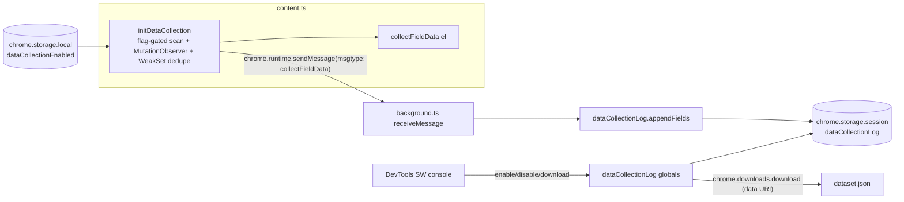

# Phishcatch Raw Data Collection (MV3)

## SCOPE - read first

- This plan targets ONLY the phishcatch repository: `/Users/ryanknittel/Documents/GitHub/phishcatch` (the `extension/` package).
- `/Users/ryanknittel/Documents/GitHub/l8p8-chrome-extension` is REFERENCE-ONLY and READ-ONLY. No files there will be created, edited, or deleted. Its `input.service.ts` is used purely as the source algorithm to re-implement inside phishcatch.

## Decisions locked in

- Data minimization (no user payloads): the `value` attribute is NEVER extracted. `textContent` of the element itself is NEVER captured for user-input fields - specifically `textarea` and `*[contenteditable="true"]` - because the typed input becomes their `textContent`. The element's own text is captured ONLY when it is a button-like input (`button`/`submit`/`reset`), as `button_text`.
- No-signal fields dropped: `tab_index` and `aria_valuetext` are NOT extracted.
- Label precedence (Requirement 3): `official_label_text` first; if empty, `fuzzy_parent_text`; if still empty, leave the label keys empty. No fallback to the element's own text content (except the button-like case above).
- Collection is gated by a `chrome.storage.local` flag. A dev enables it by calling `enableDataCollection()` in the background service-worker console; `disableDataCollection()` turns it off; `downloadDataCollectionLog()` exports.
- The record log is stored in `chrome.storage.session` (auto-cleared when the browser closes, so no startup-clear is needed). No artificial size/record cap is imposed: if the ~10MB session quota is exceeded, the `storage.session.set` rejection is allowed to surface in the service-worker DevTools console so the developer notices.
- No ML / vectorization / inference (out of scope).

## Why this differs from a typical large extension

Phishcatch is small and has NO dependency injection, NO RPC router, NO shadow-DOM helper. It uses:

- Plain `chrome.runtime.sendMessage({ msgtype, content })` in [extension/src/content.ts](extension/src/content.ts) and a `switch (message.msgtype)` in `receiveMessage` in [extension/src/background.ts](extension/src/background.ts).
- Promise-based `chrome.storage.local` / `chrome.storage.session` (already migrated).
- A single Chrome manifest at [extension/public/manifest.json](extension/public/manifest.json).
  So the feature is implemented with plain modules + the existing message switch, not new service classes.

## Architecture

## Target selector (Requirement 1)

`document.querySelectorAll('input, textarea, *[role="textbox"], *[contenteditable="true"], *[role="searchbox"], *[role="combobox"]')`. The content script already runs in `all_frames`, so each frame scans itself. Shadow DOM is not traversed (phishcatch has no helper for it); note as a known limitation.

## Step 1 - Manifest: add downloads permission

[extension/public/manifest.json](extension/public/manifest.json): add `"downloads"` (for export) to the `permissions` array (currently `["storage","notifications","alarms"]`).

## Step 2 - Types ([extension/src/types.ts](extension/src/types.ts))

- Extend `PageMessage.msgtype` union with `'collectFieldData'`.
- Add `CollectFieldDataContent { fields: RawFieldData[] }` and include it in the `PageMessage.content` union.
- Add a flat `RawFieldData` interface (all values `string | number | boolean`, no nesting). Note: NO `value`, NO `tab_index`, NO `aria_valuetext`.
    - Metadata: `collected_url`, `collected_at`
    - Structural/ARIA booleans: `tag_name`, `type`, `role`, `read_only`, `disabled`, `required`, `is_content_editable`, `aria_expanded`, `aria_haspopup`
    - Attribute text: `id`, `name`, `class_name`, `placeholder`, `data_placeholder`, `data_test_id`, `data_testid`, `autocomplete`, `aria_label`, `aria_placeholder`, `aria_roledescription`, `title`
    - Resolved ARIA relations: `aria_labelledby_text`, `aria_describedby_text`, `aria_controls_text`, `aria_errormessage_text` (plus raw id strings `aria_labelledby`, etc.)
    - Adapted from reference: `official_label_text`, `fuzzy_parent_text`, `button_text` (button/submit/reset only), `form_control_name`, `dataset_attributes`
    - Multi-valued sources joined with `" | "` to stay flat.

## Step 3 - Extraction + scanner module (NEW)

New [extension/src/content-lib/dataCollection.ts](extension/src/content-lib/dataCollection.ts), re-implementing the l8p8 `getInputText`/`getInputLabels`/`getInputLabelTextFuzzy`/`getElementText` logic adapted to populate `RawFieldData` keyed fields instead of a `string[]`:

- `collectFieldData(el: HTMLElement): RawFieldData`
    - Attributes via `el.getAttribute(...)`; booleans/props guarded with `el instanceof HTMLInputElement || el instanceof HTMLTextAreaElement` (selector includes non-form contenteditable/role nodes). NEVER read `el.value` and NEVER read the element's own `textContent` (except the button-like case below).
    - Label precedence (no user-payload fallback):
        1. `official_label_text`: for input/textarea use `el.labels` + previous/next sibling `<label>` -> `getElementText` of the LABEL element.
        2. If empty, `fuzzy_parent_text`: walk up to 4 ancestors (stop at form/heading/iframe/other inputs), `getElementText` of that ancestor; only when no `aria-label` and not hidden.
        3. If still empty, leave both keys empty - do NOT fall back to the element's own text.
    - `button_text`: ONLY when `el` is an `input` of type `button`/`submit`/`reset` (these match the `input` selector; `<button>` is not in the selector). For those, capture `el.textContent`/label as the semantic button label. This is the sole place element-own text is read.
    - `getElementText`: clone, strip `select,svg,canvas,style,script,noscript` AND `input,textarea,[contenteditable="true"]` (the latter ensures any user-typed payload inside a label/ancestor clone is removed), return `textContent`.
    - ARIA relations: split IDs for `aria-labelledby`/`aria-describedby`/`aria-controls`/`aria-errormessage`, resolve each via `document.getElementById(id)`, join `textContent` into the `*_text` keys.
    - `dataset_attributes`: join `el.dataset` entries as `key=value | ...`; `form_control_name` from `formcontrolname`.
- `initDataCollection()`
    - Reads flag `dataCollectionEnabled` from `chrome.storage.local`; subscribes to `chrome.storage.onChanged` so toggling takes effect live.
    - When enabled: query the Step-1 selector, dedupe seen nodes via `WeakSet<Element>`, map new nodes through `collectFieldData`, batch and `chrome.runtime.sendMessage({ msgtype: 'collectFieldData', content: { fields } })`.
    - `MutationObserver` on `document.body` (`subtree`, `childList`) -> debounced re-scan (reuse [extension/src/content-lib/debounce.ts](extension/src/content-lib/debounce.ts)).

## Step 4 - Content wiring ([extension/src/content.ts](extension/src/content.ts))

Import and call `initDataCollection()` from the existing `ready(...)` block (alongside the current setup), independent of `DomainType` so it can run anywhere when the flag is on.

## Step 5 - Background log module (NEW)

New [extension/src/lib/dataCollectionLog.ts](extension/src/lib/dataCollectionLog.ts):

- `appendFields(fields: RawFieldData[])`: read `dataCollectionLog` from `chrome.storage.session` (default `[]`), concat, write back. No size/record cap is applied - if `storage.session.set` rejects due to the quota, let the error propagate/log so the developer sees it in the SW console. (Single-threaded SW; cross-frame append races acceptable for a dev tool - note in code.)
- `downloadDataCollectionLog()`: read the array from `chrome.storage.session`, `JSON.stringify`, UTF-8-safe base64 (`btoa(String.fromCharCode(...new TextEncoder().encode(json)))`), build `data:application/json;base64,<...>`, call `chrome.downloads.download({ url, filename: 'dataset.json', saveAs: true })`. Data URI is required (MV3 SW has no `URL.createObjectURL`).
- `enableDataCollection()` / `disableDataCollection()`: set `chrome.storage.local` `dataCollectionEnabled` true/false.
- `registerDataCollectionGlobals()`: assign the three console functions onto `globalThis`.

## Step 6 - Background wiring ([extension/src/background.ts](extension/src/background.ts))

- In `receiveMessage`, add `case 'collectFieldData':` -> `void appendFields((message.content as CollectFieldDataContent).fields)`.
- In `setup()`, call `registerDataCollectionGlobals()` at top level so the console functions exist whenever the worker is alive.
- No startup clear is needed: `chrome.storage.session` is automatically cleared when the browser closes.

## Step 7 - Global typings (NEW)

New [extension/src/globals.d.ts](extension/src/globals.d.ts) with a `declare global` block typing `enableDataCollection`, `disableDataCollection`, `downloadDataCollectionLog` (tsconfig `rootDir` is `src`, so it is picked up).

## Caveats

- Data minimization makes records structural-only: no `value`, no user-typed `textContent`. This removes the primary PII vector. Records still include attribute strings (`id`/`name`/`class`/aria/label text) that could in rare cases embed identifiers, so dataset.json should still be handled with care. The log is session-scoped (auto-cleared when the browser closes) but survives service-worker restarts within a browsing session.
- The log has no artificial cap; on a very form-heavy/long session it can hit the ~10MB session quota, at which point `appendFields` errors in the SW console (intended - the developer exports/restarts).
- Shadow-DOM fields are not collected (no traversal helper in phishcatch).

## Verification

- `cd extension && corepack yarn build` compiles with no TS errors; emitted `dist/manifest.json` includes `downloads`.
- Load unpacked; in the SW console run `enableDataCollection()`, browse a form page (type into fields), run `downloadDataCollectionLog()` -> `dataset.json` is a flat array of structural/label records with NO `value` and NO user-typed text (verify a filled-in textarea/contenteditable record contains no typed content). `disableDataCollection()` stops new records.
- `corepack yarn build` + existing `jest` suite remain green (no existing files' behavior changed except the additive message case).
