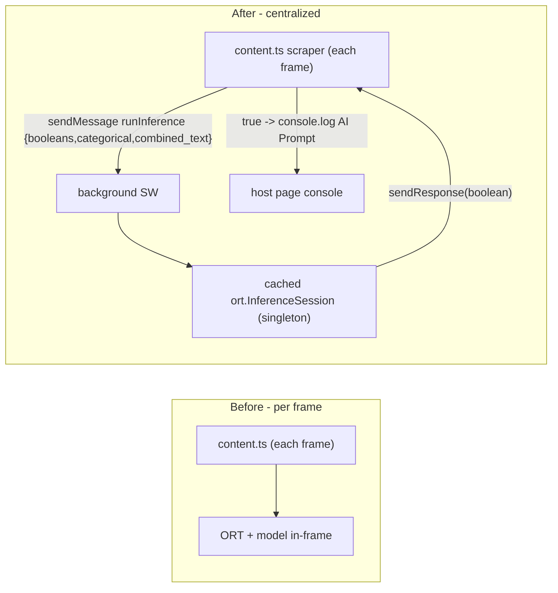

# Pivot ONNX Inference to the Background Service Worker (RPC)

## Why

- The v0.app error (`WebAssembly.instantiate(): CompileError`) is the host page's CSP blocking WASM compilation in the content-script isolated world. The service worker runs under the extension's own CSP (`script-src 'self' 'wasm-unsafe-eval'`), so WASM compiles there.
- `content_scripts.all_frames: true` loads ORT + `model.onnx` in every frame (10 ad iframes = 10 engines). Centralizing in the SW means one engine, one model.

## Architecture change



## CRITICAL constraint (the key risk)

ORT's wasm backend loads its emscripten loader via a runtime dynamic `import('.../ml/ort-wasm-simd-threaded.mjs')`. MV3 service workers permit that import ONLY as a **module service worker**. So this plan makes the background a module SW: `manifest background.type = "module"` AND webpack emits the background entry as ESM. This is the main thing to verify on first load.

## Step 1 - Manifest: module service worker ([extension/public/manifest.json](extension/public/manifest.json))

```json
"background": { "service_worker": "js/background.js", "type": "module" }
```

Keep `web_accessible_resources: [{ "resources": ["ml/*"], "matches": ["<all_urls>"] }]` - the content script still fetches `ml/feature_schema.json` (the SW fetches `model.onnx`/wasm from its own origin and does not need WAR, but leaving `ml/*` is harmless; could be narrowed to `ml/feature_schema.json`).

## Step 2 - Webpack: emit background as ESM ([extension/webpack/webpack.common.js](extension/webpack/webpack.common.js))

- Enable module output and scope it to the background entry only (popup/content must stay classic - content scripts cannot be ESM):

```js
entry: {
    popup: path.join(__dirname, srcDir + 'popup.tsx'),
    background: { import: path.join(__dirname, srcDir + 'background.ts'), library: { type: 'module' } },
    content: path.join(__dirname, srcDir + 'content.ts'),
},
experiments: { outputModule: true },
```

- Keep: the `onnxruntime-web$` alias to `ort.wasm.bundle.min.mjs`, the `ort-wasm-simd-threaded.wasm` asset rule, the CopyPlugin patterns (pipeline/export + `ort-wasm-simd-threaded.mjs` -> `dist/ml`), `output.publicPath: ''`, and `splitChunks` excluding `background` (background stays a single self-contained ESM file).
- Effect: ORT is now imported only by `background.ts`, so it bundles into `background.js` and leaves `vendor.js` (popup/content). content/popup shrink.
- Risk to verify: per-entry ESM output in webpack 5.74 alongside `ProvidePlugin` (process/Buffer used transitively by `pbkdf2`). If the ESM background build misbehaves, fallback is keeping classic output but `type: "module"` in the manifest (a classic single-file bundle loaded as a module also grants `import()` semantics).

## Step 3 - Message types ([extension/src/types.ts](extension/src/types.ts))

- Add `'runInference'` to the `PageMessage.msgtype` union.
- Add and include in the content union:

```ts
export interface InferenceRequestContent {
    booleans: number[]; // 1/0 per boolean_keys order
    categorical: string[]; // per categorical_keys order
    combined_text: string;
}
```

(Use plain `number[]` not `Float32Array` - `chrome.runtime.sendMessage` JSON-serializes, so typed arrays would corrupt; the SW rebuilds the `Float32Array`.)

## Step 4 - SW inference engine (NEW [extension/src/lib/inferenceRPC.ts](extension/src/lib/inferenceRPC.ts))

- `import * as ort from 'onnxruntime-web'` (moved here from the content module).
- Module-level singletons: `session`, `initPromise`, `inferenceDisabled` (the cold-start cache - survives within an awake SW, re-inits after the SW is recycled).
- `ensureSession()`: idempotent; on first call set `ort.env.wasm.wasmPaths = chrome.runtime.getURL('ml/')`, `ort.env.wasm.numThreads = 1`, fetch `ml/model.onnx` as ArrayBuffer, `ort.InferenceSession.create(...)`, cache. Wrap in try/catch -> set `inferenceDisabled`, `console.warn`.
- `runInference(payload: InferenceRequestContent): Promise<boolean>`: `await ensureSession()`; if disabled return false; build tensors (FLAT primitive string arrays):
    - `new ort.Tensor('float32', Float32Array.from(payload.booleans), [1, payload.booleans.length])`
    - `new ort.Tensor('string', payload.categorical.map(String), [1, payload.categorical.length])`
    - `new ort.Tensor('string', [payload.combined_text], [1, 1])`
    - `session.run({ booleans, categorical, combined_text })`; return positive via `Number(out.label.data[0]) === 1` (int64 BigInt). The SW needs no schema - tensor dims come from the payload array lengths.

## Step 5 - Background listener wiring ([extension/src/background.ts](extension/src/background.ts))

Replace the bare `chrome.runtime.onMessage.addListener(receiveMessage)` with a synchronous wrapper that supports an async RPC response (Chrome requires `return true` + `sendResponse`, not a returned Promise):

```ts
chrome.runtime.onMessage.addListener((message, _sender, sendResponse) => {
    if (message && message.msgtype === 'runInference') {
        runInference(message.content)
            .then(sendResponse)
            .catch(() => sendResponse(false));
        return true; // keep channel open for async sendResponse
    }
    void receiveMessage(message); // existing fire-and-forget path unchanged
    return false;
});
```

Init stays lazy (first RPC warms the session) per the cold-start design.

## Step 6 - Content script becomes a scraper ([extension/src/content-lib/inference.ts](extension/src/content-lib/inference.ts))

- Remove `import * as ort`, `ort.env`/`wasmPaths`/session/Tensor logic.
- Keep: the one-time `feature_schema.json` fetch (content still orders keys), `collectFieldData`, `COLLECTION_SELECTOR` scan, `WeakSet` dedupe, debounced `MutationObserver`.
- `buildBooleans` now returns `number[]` (0/1). `buildCategoricals`/`buildCombinedText` unchanged.

### Refinement 1 - tokenization parity (no client-side cleaning)

The features sent over RPC must match what Python fit on, character-for-character, because the embedded ONNX TF-IDF uses the custom `token_pattern=[a-zA-Z0-9]{2,}` (splits on underscores/hyphens) and `lowercase=True`. The content script must NOT do any tokenization-like cleaning of its own:

- `buildCombinedText`: only `String(v).trim()` per text value (this mirrors Python `str(v).strip()`), drop empties, single-space join. NO lowercasing, NO punctuation/regex stripping, NO underscore/hyphen splitting - the ONNX graph tokenizes and lowercases natively.
- `buildCategoricals`: pass the raw extracted strings as-is with only the null/undefined/empty -> `""` mapping (NO `.trim()`, NO case changes) - matches Python's `fillna("").astype(str)`, and `OneHotEncoder` matches exact category strings.
- Net: the only normalization on the TS side is the whitespace trim/empty-drop that the Python preprocessing also performs; everything else is left verbatim for the ONNX graph.

### Refinement 2 - dedupe before the message bus

Guard with the `WeakSet` BEFORE any `chrome.runtime.sendMessage`, so rapid SPA mutations never flood the RPC bus with duplicates. In the scan loop, check-and-add synchronously, then send:

```ts
for (const el of elements) {
    if (seenElements.has(el)) continue; // reject instantly, before any RPC
    seenElements.add(el); // mark before the await so re-entrant scans skip it
    void classify(el); // classify() is what issues sendMessage
}
```

Because `seenElements.add(el)` happens synchronously before the `await chrome.runtime.sendMessage` inside `classify`, an element is never queued twice even if the debounced observer fires again mid-flight.

- `classify(el)`:

```ts
const raw = collectFieldData(el);
const content: InferenceRequestContent = {
    booleans: buildBooleans(raw, schema.boolean_keys),
    categorical: buildCategoricals(raw, schema.categorical_keys),
    combined_text: buildCombinedText(raw, schema.text_keys)
};
const isPrompt = await chrome.runtime.sendMessage({
    msgtype: 'runInference',
    content
});
if (isPrompt === true) console.log('🚨 AI Prompt Detected:', el, raw);
```

- `content.ts` keeps calling `runInferenceScan()` (unchanged). Note: the RPC convention uses the codebase's `{ msgtype, content }` shape (not the prompt's verbatim `{ type, payload }`) for consistency with the existing `receiveMessage` switch.

## Caveats

- Cold start: after ~30s idle the SW is recycled and the next RPC re-fetches/recompiles the model (~100-400ms). Acceptable since scanning is async/off the UI thread; the singleton makes subsequent calls instant.
- Module SW is the linchpin - if dynamic import still fails in the SW, the fallback ladder is: (a) keep `type: "module"` but classic webpack output, then (b) pin an older onnxruntime-web that loads via `importScripts` in a classic SW.
- `ai.onnx.ml` op support / parity is unchanged (same model), so if it ran in the content script before the CSP block, it will run in the SW.

## Verification

- `corepack yarn build` succeeds; `dist/js/background.js` is ESM and self-contained; `dist/ml/` still has `model.onnx`, `feature_schema.json`, `ort-wasm-simd-threaded.wasm` + `.mjs`; `dist/manifest.json` background has `"type": "module"`.
- Load unpacked, open the SW console: first detection RPC triggers session init with no CSP error; `vendor.js` no longer contains ORT.
- On v0.app and chatgpt.com: content-script console logs `🚨 AI Prompt Detected:` for the prompt box (the host-page CSP no longer matters since WASM runs in the SW), and search/login/file inputs do not log.
- `jest` suite remains green.
